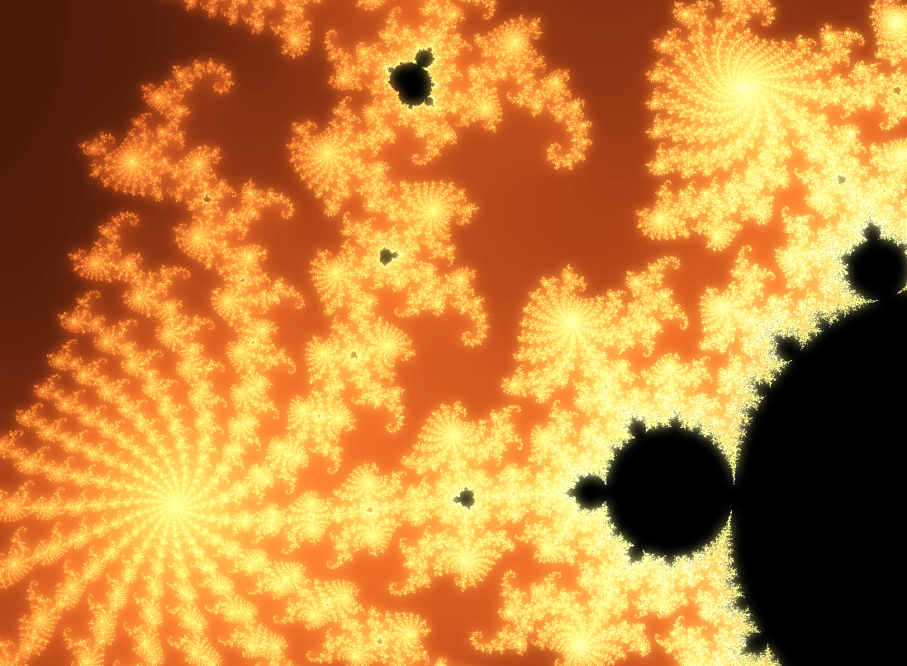

# mandelbrot-shader

Mandelbrot shader implemented using PIXI.js, which is mostly used to simplify shader loading.

Since PIXI.js cannot (as far as I know) use GLSL 2/3 ES syntax the shader is written in GLSL 1. Also - WebGl (or GLSL ES, not sure about naming) restricts floating point resolution quite a bit, especially on mobile devices, resulting in poor quality when zooming. Works better in a PC browser.

This simulation is fairly taxing on the GPU, both regarding compute and memory and may not run at all on older devices with less powerful GPUs.

Not much to say otherwise, it is a classic Mandelbrot fractal :-)

- `npm run dev` - start dev server (clean caches, copy static assets etc.)
- `npm run build` - create build, does NOT use scope hoisting since that seems to mess up resulting code

⚠️ __Note:__ Since no TypeScript compilation is done, more advanced TS features like [Parameter Properties](https://www.typescriptlang.org/docs/handbook/2/classes.html#parameter-properties) cannot be used.

- Uses [PIXI.js](https://pixijs.com/) (via npm) to render via WebGL (via HTML Canvas)
- Uses fragment shaders for fractal rendering
- Uses [Parcel](https://parceljs.org/) to bundle it up and run dev server, bundles everything except static assets into a single html file

Live: https://jakobmollas.github.io/mandelbrot-shader/

